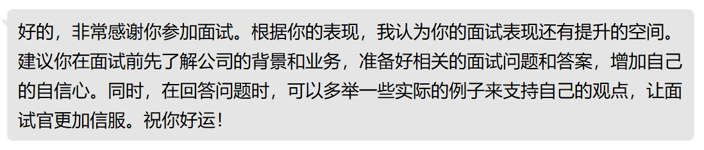

# InterviewerGPT - 你的私人面试官！



## 简介

InterviewerGPT 提供了一套可用于面试的 AI Prompt 及其实现，可用于模拟面试场景，帮助您更好地准备面试。

InterviewerGPT 目前只提供了 OpenAI API 接口，和 Mirai Console Plugin 实现，欢迎贡献其他接口和实现！

## 安装方法

### 作为 Mirai Console 插件启动

1. 运行 `gradle mirai-console-plugin:buildPlugin` 编译插件；
2. 从 `./mirai-console-plugin/build/mirai` 文件夹内获得插件文件；
3. 设置 `OPENAI-TOKEN` 环境变量为您的 OpenAI API token(secret)；
4. 将编译好的插件文件放入 Mirai Console 的插件文件夹内，运行 Mirai Console。

### 作为 Mirai Console 嵌入应用启动

1. 设置 `OPENAI-TOKEN` 环境变量为您的 OpenAI API token(secret)；
2. 直接运行 `gradle mirai-console-plugin-starter:run` 即可。

## 使用方法

### 作为 API 使用

- 请自行参照 `common` 模块内的代码使用即可。

### 作为 Mirai Console 插件或 Mirai Console 嵌入应用使用

1. 在任一机器人所在群聊或与机器人私聊输入 `/开始面试` 即可开始面试
2. 根据机器人的要求进行面试回答
3. 输入 `/结束面试` 以结束面试

## 协议

> 请注意，为简要起见，以下许可证概要可能是片面或不完整的，这些概要并不构成任何法律声明和法律建议，请阅读许可证原文以了解该许可证赋予您的完整权利和义务。

此项目使用 **GNU Affero General Public License v3.0（GNU Affero 通用公共许可证 版本3.0）** 授权，这意味着您可以在遵守项目版权人要求（如果有）和
GNU Affero General Public License v3.0 许可证要求的前提下对项目进行**再分发，修改，私人使用，专利使用，商业化使用**。

您**不被允许**将本项目与专有程序合并后再分发，除非该专有程序属于操作系统库的一部分。

要使该许可证赋予您的权利对您生效，您**必须将本许可证的完整文本以一种合理的方式展示在您的项目中**
，以确保您项目的用户（无论是开发者还是终端用户）可以浏览到；您**应当告知您的用户此项目是否相对原项目有所修改**；在**分发软件
**时，您**必须提供源代码**；如果**修改，再分发，合并软件**，您**必须使用相同许可证分发**；如果您通过网络方式向用户提供基于该项目的服务的修改版，那么您
**必须提供此修改版程序的源代码**。

版权人被允许在 GNU Affero General Public License v3.0 许可证的要求之外附加额外条款，这些额外条款只能是 GNU Affero General
Public License v3.0 许可证第 7 条中规定的 6 个附加许可中的一个或多个。除此之外的许可并不被允许和 AGPLv3
协议共存，如果你看到软件声明了那些额外的许可，你可以去掉他们。

只要您遵守这些要求，版权人就无法收回你的这些权利。

请注意，版权人**不为您对该项目的使用提供任何担保或背书**，您对该项目的使用依然需要遵守您所在地任何可适用的法律。

此许可证的完整文本应该已包含在项目中，如果没有，请参见[此处](https://www.gnu.org/licenses/agpl-3.0-standalone.html)。

```
Copyright (c) 2023 HikariLan

This program is free software: you can redistribute it and/or modify
it under the terms of the GNU Affero General Public License as published by
the Free Software Foundation, version 3 of the License, or
(at your option) any later version.

This program is distributed in the hope that it will be useful,
but WITHOUT ANY WARRANTY; without even the implied warranty of
MERCHANTABILITY or FITNESS FOR A PARTICULAR PURPOSE.  See the
GNU Affero General Public License for more details.
```